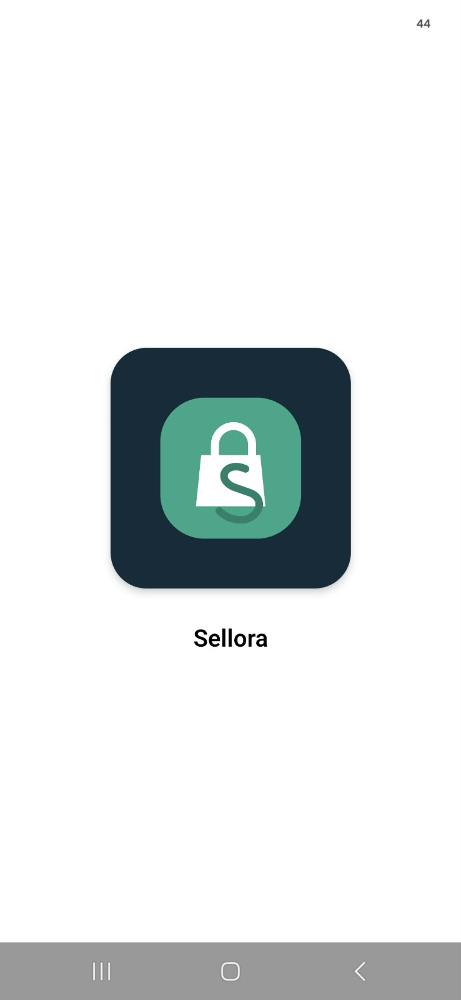
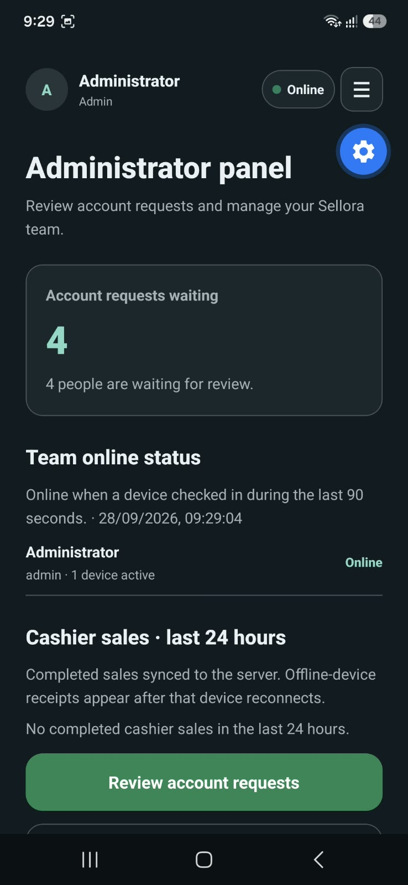
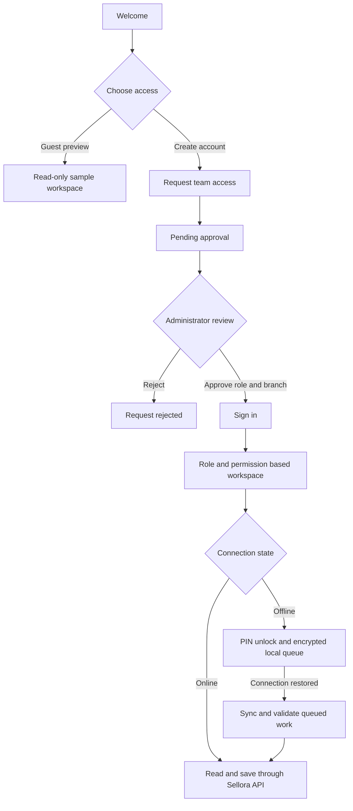

# Sellora

**A mobile point of sale and retail operations workspace for independent teams.**

Sellora brings checkout, stock, purchasing, customer accounts, staff access and business reporting into one Expo app. It supports online work through the Sellora API and queues selected work securely when a device is offline.

<p align="center">
  
  &nbsp;&nbsp;&nbsp;
  
</p>

<p align="center"><sub>Sellora on Android · App launch and administrator dashboard</sub></p>

## What you can do

| Area | Capabilities |
| --- | --- |
| **Point of sale** | Product search, barcode workflow, cart, discounts, customer selection, split payments, receipts and returns. |
| **Catalog and stock** | Products, variants, categories, brands, warehouses, inventory adjustments and branch transfers. |
| **Retail operations** | Customers and store credit, suppliers, purchase orders, expenses, shifts and commissions. |
| **People and access** | Account requests, administrator approval, team roles, permission catalog, branch assignments, profile settings and online presence. Updated profile photos appear in the shared header and drawer for every role. |
| **Business overview** | Sales reports, cashier activity, targets, finance summaries, notifications and permission-scoped Sellora Insights. |
| **Flexible access** | A read-only guest tour, device PIN unlock, optional Remember me on the sign-in screen, and an app drawer for navigation and account actions. |
| **Offline work** | Cached product and branch data plus encrypted queues for supported sales, customers, expenses and product edits; queued sales are checked by the server when they sync. |

## Screenshots

| App launch | Administrator workspace |
| --- | --- |
|  |  |

## How it is built

- **Mobile app:** Expo Router, React Native, TypeScript and SQLite for encrypted offline data and queued work.
- **API and authentication:** Self-hosted Express API with Better Auth for email/password accounts, sessions and password-reset integration.
- **Business data:** PostgreSQL with PostgREST and row-level security. The API binds requests to the signed-in user before database access.
- **Private media:** The API stores and authorizes product, customer, expense and avatar files.
- **Deployment:** Local development or Linux systemd/Nginx templates under [`deploy/`](deploy/). Docker is not required.

Supabase is not required at runtime. The historical schema and policy migrations remain under `supabase/migrations/`; active self-hosted database migrations are under [`backend/migrations/`](backend/migrations/).

## Run locally

### Requirements

- Node.js 22.13 or later (`.nvmrc` targets Node 24)
- PostgreSQL
- Expo Go for a phone preview, or an Android/iOS development environment for a native build

### 1. Install dependencies

From the repository root:

```sh
nvm use                 # optional when nvm is installed
npm install
cd backend && npm install && cd ..
```

### 2. Configure PostgreSQL and the API

Create a PostgreSQL database and a restricted application role. Copy `backend/.env.example` to `backend/.env`, then configure the database URL, a random `BETTER_AUTH_SECRET` of at least 32 characters, and the API URL. For a phone on the same Wi-Fi, use the development computer's LAN address, for example `http://192.168.1.20:4100`.

From `backend/`, initialize the auth schema, build and apply the Sellora migrations, then prepare the local PostgREST roles/configuration:

```sh
npm run auth:migrate
npm run build
npm run db:migrate
node scripts/prepare-postgrest.mjs
```

Keep `backend/.env` private. Never put `DATABASE_URL`, `BETTER_AUTH_SECRET`, or the PostgREST signing secret in the Expo app configuration.

### 3. Configure and start the app

In the repository root, copy `.env.example` to `.env` if you want to set the API address explicitly:

```dotenv
EXPO_PUBLIC_API_URL=http://192.168.1.20:4100
```

For a phone preview, set this to the computer's LAN IP, not `localhost`. Open three terminals:

```sh
# backend/ — API
npm start
```

```sh
# backend/ — PostgREST
npm run rest:dev
```

```sh
# repository root — Expo
npx expo start --lan
```

Scan the Metro QR code with Expo Go on the same Wi-Fi. Keep the computer, API, PostgreSQL and PostgREST running during local use. The API health endpoint is `http://<computer-ip>:4100/health`.

## First administrator and team access

Create the first account from **Administrator portal → Request administrator access**. From `backend/`, the database owner then bootstraps that account once:

```sh
npm run admin:bootstrap -- owner@example.com
```

Replace the example address with the account's email. The bootstrap refuses to promote another account after an approved administrator exists. The first administrator signs in from **Administrator portal → Administrator sign in**; normal team signup cannot grant administrator access. Administrators review requests, assign roles and branches, and manage team status from the in-app administrator panel.

After setup, create a branch, warehouse, catalog and opening stock. Account registration does not depend on email delivery; password recovery requires a configured local sendmail-compatible mail service. See [`backend/README.md`](backend/README.md) for mail and database setup.

## End-to-end app flow



The first administrator is provisioned once with the bootstrap command above. After that, administrators review new requests and maintain team access in the app. During offline work, queued transactions stay attached to their original user and are revalidated by the server when synchronized.

## Online and offline behavior

The phone must be able to reach the Sellora API for online features. Previously signed-in users can unlock with their device PIN while disconnected. The app keeps supported cached catalog, branch and warehouse data available locally. Cash/card and customer/store-credit sales, customer creation, expenses (including staged receipt images), and product or variant edits can be queued on device. The local queue is encrypted, and the server rechecks permissions, stock, prices and customer credit when work syncs. Some administrator, purchasing and stock-receiving actions require a live API connection. See the API guide for the current migration and offline boundaries.

Guest access is a read-only tour. Sample checkout and approval actions remain in the preview and do not create production accounts or business records.

## Checks

Run these from the repository root:

```sh
npm run typecheck
npm run api:build
git diff --check
```

`GET /health` checks API/database connectivity. The optional health-only load script is documented in [`backend/README.md`](backend/README.md); it does not measure authenticated signup or checkout capacity.

## Deployment and data migration

Linux service and Nginx templates are in [`deploy/`](deploy/). A public installation still needs a provisioned server, DNS, HTTPS and protected production environment variables. Do not expose PostgreSQL or PostgREST directly to the internet. Back up the PostgreSQL database and private file storage together.

The local database setup creates the Sellora schema; it does not automatically import accounts or business data from an older hosted database. Review and verify any export/import before retiring the previous service. Sessions must be re-established after an account migration. Deployment, mail delivery and real-device offline sync need verification in the target environment.

## Security and production readiness

The app sends business requests through the Sellora API, which binds database operations to the authenticated user and relies on PostgreSQL row-level policies and server-side permission checks. Account approval controls access; the public signup flow cannot grant administrator approval. Private media uses authenticated access checks and short-lived signed links. Local queued business data is encrypted, device PIN verification is stored in SecureStore, and Remember me is opt-in and uses secure device storage.

Before exposing a deployment to the public internet, set a production-only `TRUSTED_ORIGINS` list (do not keep the broad Expo development origin), use HTTPS, protect unique server secrets, keep PostgreSQL and PostgREST private, configure mail delivery, and test database/file backups and restores. Review dependency advisories and deployment-specific access rules before launch. This repository has not had an independent penetration test or a production infrastructure audit, so those target-environment checks remain part of launch readiness.

## Project map

```text
app/                    Expo screens and navigation
components/             Shared interface components
providers/              Auth, connectivity, currency and offline sync
services/               API, local data, POS and business operations
backend/src/            Express API and Better Auth configuration
backend/migrations/     PostgreSQL schema and policy migrations
backend/scripts/        Database, PostgREST and load-check helpers
deploy/                 systemd and Nginx templates
docs/screenshots/       README product screenshots
```

For backend setup, endpoints, local capacity checks and Linux deployment steps, see [`backend/README.md`](backend/README.md).
